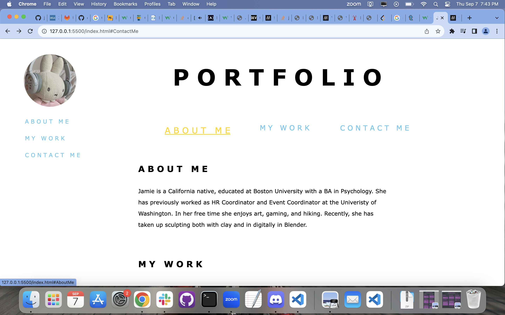
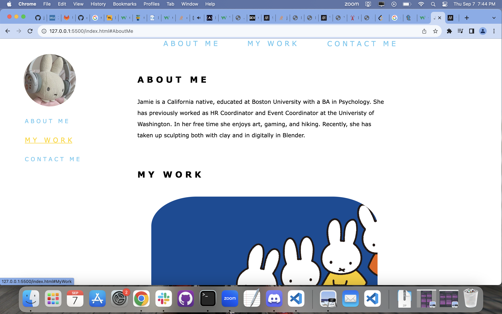
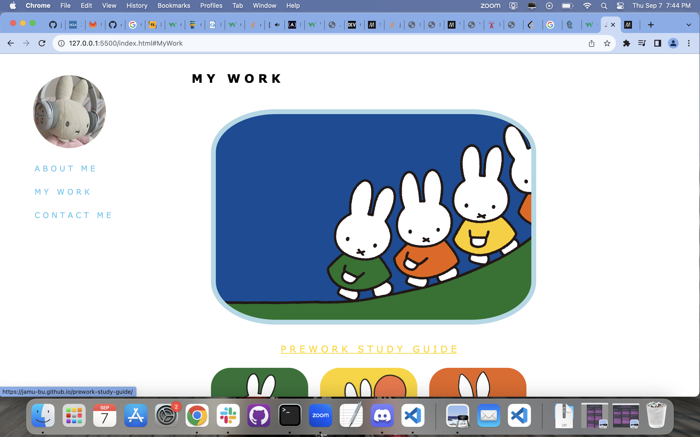
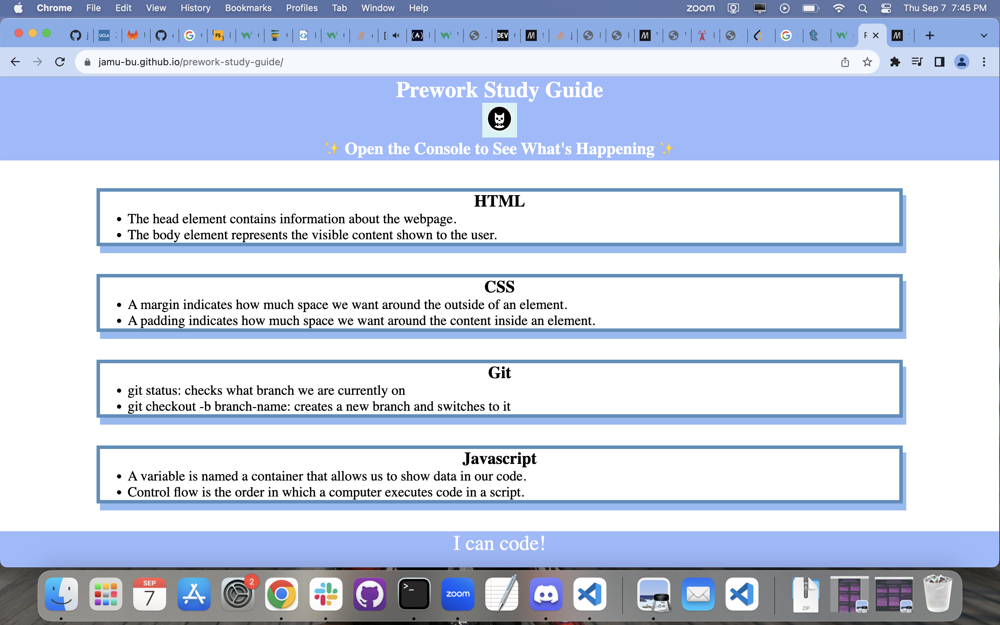
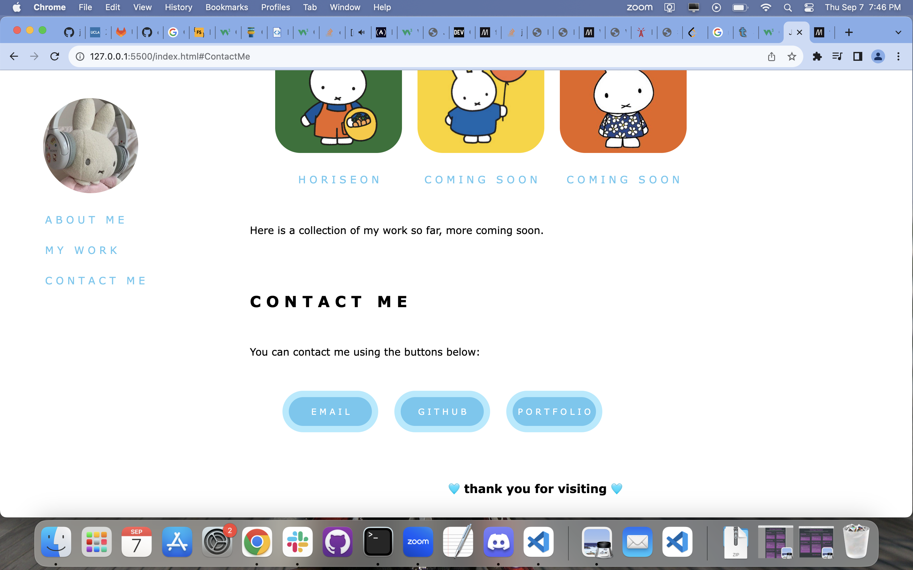
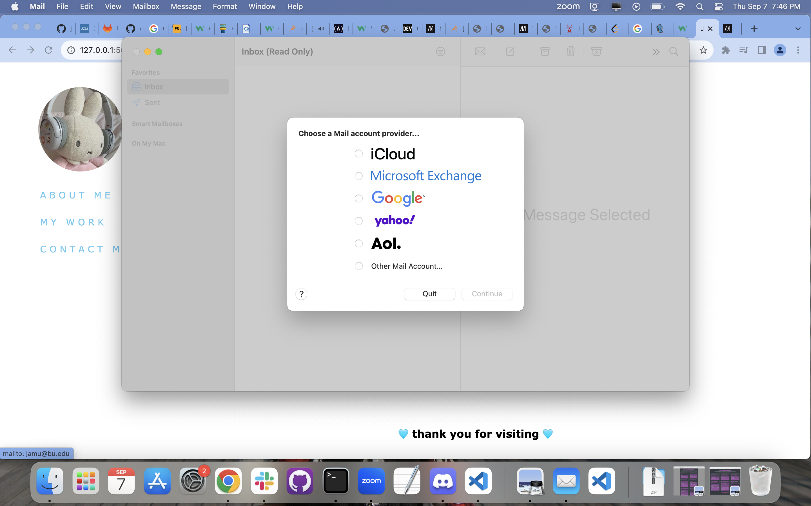
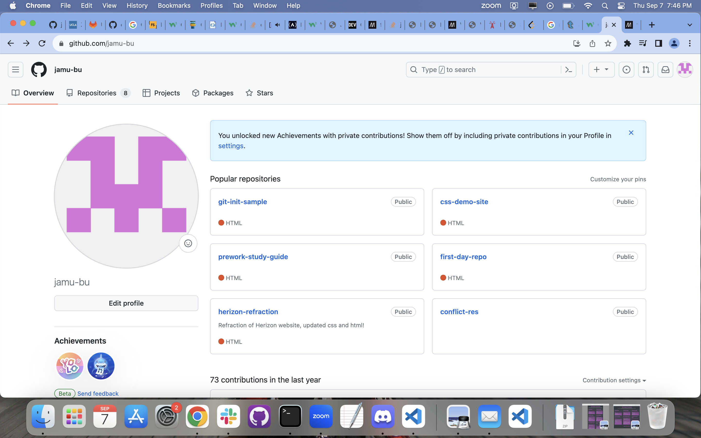
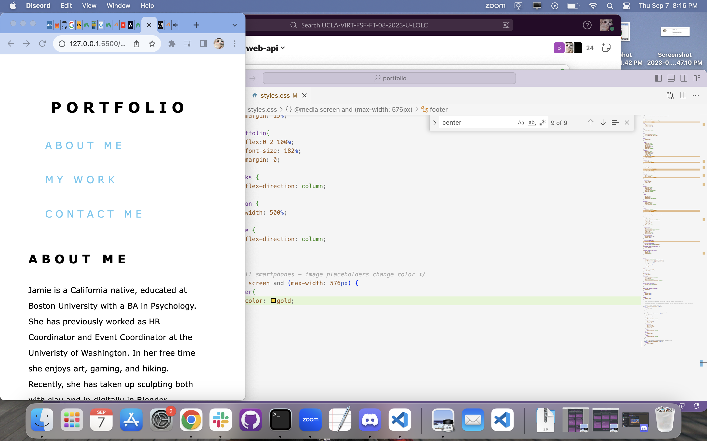
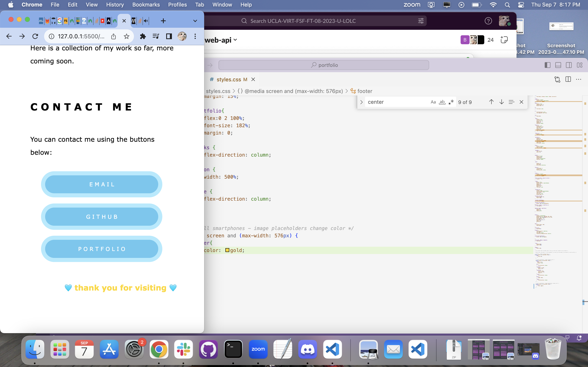

# Portfolio

This is my portfolio made with CSS and HTML.

## Installation

N/A Webpage is viewable online

## Usage
This is the webpage displayed at full screen,
    ```md
    

Hovering over "about me" in either the horizontal navigation or sidebar will highlight the feature in gold, clicking on it will bring you to the area of the webpage 
entitled "about me", selecting my work.
    ```md
    

Will bring you to that portion of the webpage where "My Work" is displayed. 
    ```md
    

Hovering over "Prework-Study Guide" will create an outline around the image and caption and Selecting will open the page in a new window.
    ```md
    


Selecting "Contact Me" will bring you to the section of my webpage entitled "Contact Me"
    ```md
    

Selecting the Email button will prompt the browser to open an email query
    ```md
    

Selecting the Github button will open my github page in a new browser
    ```md
    

When browser window is minimized, sidebar disappears, horizontal navigation links are stacked in a column,
    ```md
    

When browser window is minimized, buttons are displayed stacked in a column verus horizontally in a row. 
    ```md
    
Please make sure to update tests as appropriate.

## License

[MIT](https://choosealicense.com/licenses/mit/)

    ```

## Credit
Readme.md Guide(https://coding-boot-camp.github.io/full-stack/github/professional-readme-guide)
CSS Tutorials (https://www.w3schools.com/)


## How to Contribute

If you created an application or package and would like other developers to contribute it, you can include guidelines for how to do so. The [Contributor Covenant](https://www.contributor-covenant.org/) is an industry standard, but you can always write your own if you'd prefer.

